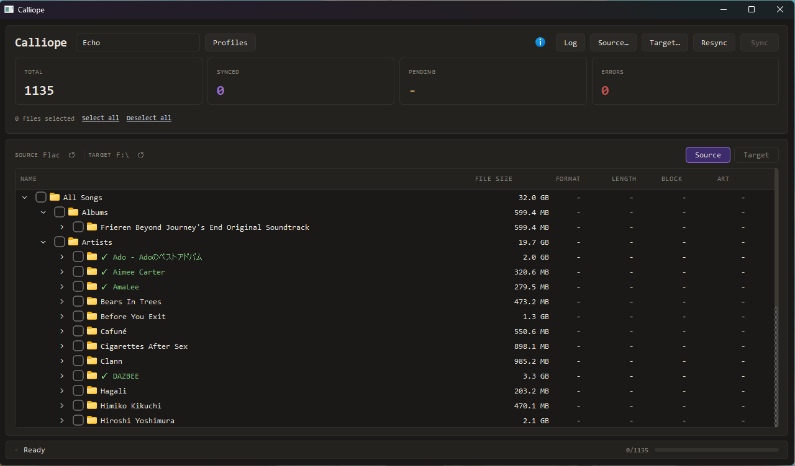
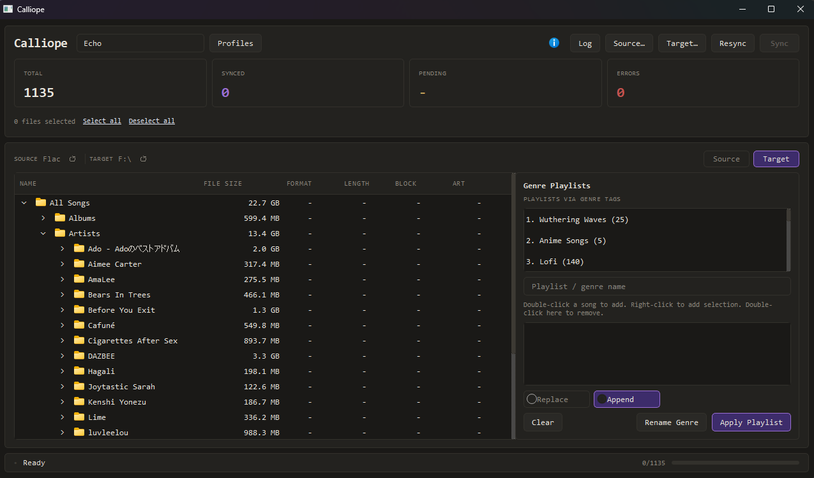
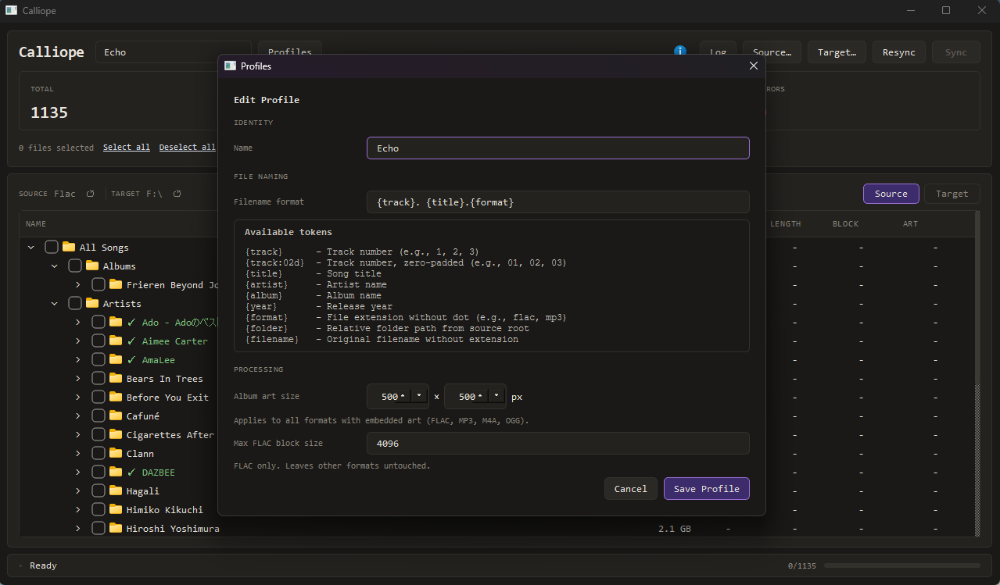

# Calliope

A desktop app for syncing music to the **Snowsky Echo / Echo Mini** (or any USB music player). Handles FLAC block-size encoding, album art resizing, filename formatting, and genre-based playlists — all in one place.

> **Source library is never modified.** All processing and writes happen on the target device only.

---

## Screenshots


*Source library — scan your music folder, check what to sync, double-click to preview*


*Target browser — view device files, manage genre playlists*


*Profiles — save different sync setups with their own formatting and processing options*

---

## Features

**Library scanner**
- Scans your source folder and displays everything in a file tree
- Shows file size, format, duration, block size (FLAC), and art dimensions for all formats
- Check/uncheck individual files or whole folders to include in a sync
- Scan progress updates as it goes

> **Note on large libraries:** Scanning can and will freeze the UI while it reads metadata. Just wait it out — it will finish.

**Preview player**
- Double-click any song in the source library to open a mini player
- Shows album art, song title, and artist
- Seek bar, play/pause, and volume control
- Volume starts low and is remembered between sessions

**Device browser**
- Browse the device folder the same way as the source
- Files already synced show a checkmark next to the name
- Right-click any file (or a multi-selection) to delete from the device

**Syncing**
- Copies checked files from source to target
- FLAC files are re-encoded with the correct block size (optional, can disable per profile)
- Album art is resized for all supported formats: FLAC, MP3, M4A, OGG
- Keeps a sync state so already-synced files are tracked automatically

**Why block size?**
Some posts on the Snowsky forums reported "Format Not Supported" errors for FLAC files with large block sizes. I haven't run into this myself, but adding a block-size limit seemed like a reasonable precaution.

**Why resize album art?**
A few reports mentioned larger art not rendering at all on the device. It's also a small screen, so you don't need a 1500×1500 image. Resizing helps with that and probably doesn't hurt performance either.

**Filename formatting**
- Customize the output filename with tokens
- Supported tokens: `{title}`, `{artist}`, `{album}`, `{track}`, `{disc}`, `{year}`, `{genre}`, `{folder}`, `{filename}`, `{format}`
- `{folder}` mirrors your source folder structure on the device

**Profiles**
- Save multiple sync setups as named profiles
- Each profile stores filename format, art size, and block size settings

**Genre playlists**
The Snowsky Echo doesn't support playlists natively, but it reads genre tags. This feature lets you use genre tags on device files as playlists — an idea originally posted by the community [here](https://www.reddit.com/r/snowsky/comments/1pw2t3v/creating_playlists_using_genre_in_echo_mini_part_1/).

- All genres on your device files appear in a list
- Files with no genre show up under **(No Genre)** so nothing gets lost
- Build a playlist by double-clicking songs in the device tree, or right-click to add multiple at once
- Apply writes the genre tag to all selected files
- Append mode adds to existing tags; replace mode clears and sets new
- Rename a genre to merge it with another (useful when the same thing got tagged two different ways)
- Remove a genre from all its files at once
- Double-click a song in the builder to remove it

---

## Running

**Option 1 — Manual**

Requires Python 3.11+.

```
pip install -r requirements.txt
python src/main.py
```

**Option 2 — Batch file**

Run `calliope.bat`. It sets up a virtual environment in the project folder, installs dependencies into it, and launches the app. Nothing gets installed outside the project directory.

---

## Built With AI

Calliope was developed with AI assistance — specifically Claude. I planned what it should do, made decisions along the way, and did the testing. The AI wrote most of the code.

That felt worth mentioning.

---

- reign
